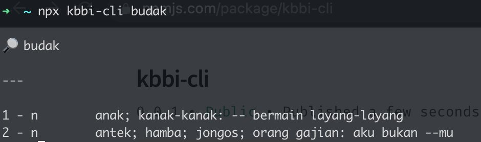

# KBBI CLI (Kamus Besar Bahasa Indonesia versi Command Line)



## basic usage

```
npx kbbi-cli <cari_kata>
```

## install KBBI CLI

```
npm i -g kbbi-cli
```

## search for a word in KBBI

```
kbbi-cli <word>
```

## check kbbi-cli version

```
kbbi-cli -v
```
